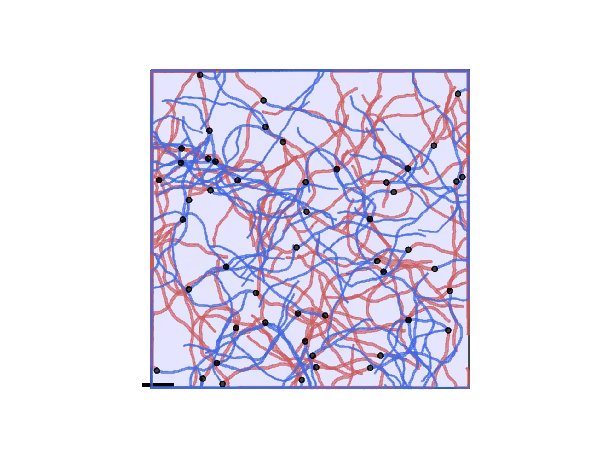
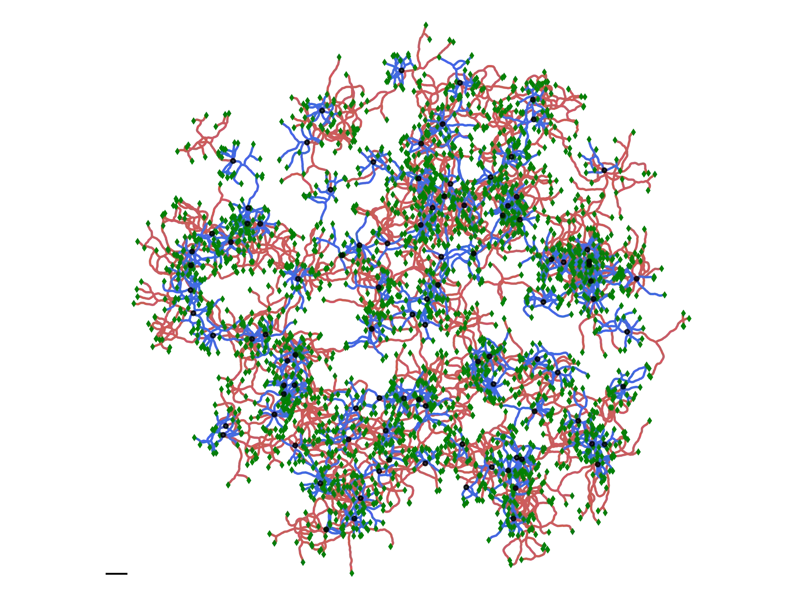

.. _tuto:

========
Tutorial
========

A quick tour of what can be done with |name|.

.. contents::
    :local:

A single neuron
===============

First, one should import all the modules and variables that are necessary
for the simulation:

.. literalinclude:: ../../examples/tutorials/1_first-steps.py
    :linenos:
    :language: python
    :lines: 30-31

The first line makes the DeNSE simulator available and let us call it through the variable ``ds``. The second line imports all the
units (e.g. time units like ``ms``, ``minutes``...) which will be used to set the properties of the simulation and of the neurons.

Once this is done, we can create our first neuron:

.. literalinclude:: ../../examples/tutorials/1_first-steps.py
    :linenos:
    :language: python
    :lines: 37

This creates a default neuron without any neurites (a single soma). Let's add an axon and a dendrite:

.. literalinclude:: ../../examples/tutorials/1_first-steps.py
    :linenos:
    :language: python
    :lines: 40

by default, neurons have their ``has_axon`` variable set to ``True``, meaning that the first created neurite will be
an axon and all subsequent neurites will be dendrites.
Now that the neurites have been created, they can be accessed through ``n.axon`` and ``n.dendrites`` (or ``n.neurites``
to get all of them at the same time). We will set the parameters of the dendrite to make it grow more slowly than the
axon.
Because the default name of the first dendrite is ``"dendrite_1"``, this reads:

.. literalinclude:: ../../examples/tutorials/1_first-steps.py
    :linenos:
    :language: python
    :lines: 45-57

One can then plot and simulate the growth of this neuron:

.. literalinclude:: ../../examples/tutorials/1_first-steps.py
    :linenos:
    :language: python
    :lines: 60-68

Two interacting neurons
=======================

Again, import all necessary modules and variables:

.. literalinclude:: ../../examples/tutorials/2_interacting-neurons.py
    :linenos:
    :language: python
    :lines: 29-30

Once this is done, we can set the various parameters for the simulation and the neuronal properties:

.. literalinclude:: ../../examples/tutorials/2_interacting-neurons.py
    :linenos:
    :language: python
    :lines: 35-58

The first line here declares the number of OpenMP processes that will be used, i.e. how many parallel threads will be used to perform the simulation.
The second line will be used to set the number of neurons that will be simulated.

The third part contains the parameters related to the simulation: the timestep used to run the simulation, the number of threads used in the parallel
simulation, the random seeds that will be used to  generate random numbers (one per OpenMP thread), and whether the neurons are embedded in spatial
boundaries.

Eventually, the ``neuron_params`` dictionary on line 11 contains the information that will be used to describe the growth of the two neurons, all
expressed with their proper units (distances in microns, speed in micron per minutes, and branching events in ``counts per hour'').
As no environment was specified here, the positions of the neurons is also specified; there orientation (the direction of the axon) will be set randomly.
Though we used the same parameters for both neurons here, this is not necessary and different parameters can be passed for each neurons through a list,
as shown for the positions on line 15.

Once all these parameters are declared, we can configure DeNSE and create the neurons so that everything is ready for the simulation.

.. literalinclude:: ../../examples/tutorials/2_interacting-neurons.py
    :linenos:
    :language: python
    :lines: 60-65

As can be seen above, one uses the ``ds`` variable to access the simulator main function. 
The :func:`~dense.set_kernel_status` function is used here to transfer the parameters to the kernel of DeNSE (the main simulator units).
Once this is done, the :func:`~dense.create_neurons` is called in order to obtain two neurons with the specific set of parameters declared
in ``neuron_params``, and two neurites (by default the first is an axon, and the second is a dendrite) which initially possess a single
branch protruding from the soma.

Once the neurons are created one can visualize them using :func:`~dense.plot.plot_neurons`.
The initial condition of the neurons can thus be visualized before starting the simulation.

Following neuron creation, the simulation can be started and its result can be visualized again:

.. literalinclude:: ../../examples/tutorials/2_interacting-neurons.py
    :linenos:
    :language: python
    :lines: 68-76

After this first 7 day simulation, the parameters of the neurons can be changed to account for changes in developmental mechanisms, so that these new
parameters can be used to simulate the next part of these cells' growth.

.. literalinclude:: ../../examples/tutorials/2_interacting-neurons.py
    :linenos:
    :language: python
    :lines: 79-98

Here we changed separately the dendritic and axonal parameters using the :func:`~dense.set_object_properties` function on the two neurons which are
stored in the ``n`` variable (the neurons stored in a :class:`~dense.elements.Population` object).

Once the simulation is over, the shapes of the neurons that were obtained can be saved in standard morphology formats such as SWC_ or MorphoML (NeuroML_).
Note that the ``neuroml`` python module is necessary to use :func:`~dense.io.save_to_neuroml`.

.. literalinclude:: ../../examples/tutorials/2_interacting-neurons.py
    :linenos:
    :language: python
    :lines: 102-103

Multiprocessing and random number generation
============================================

DeNSE support parallel simulations at the C++ level using OpenMP_ shared memory thread parallelism.
Currently, the number of threads must be set at the beginning of a script, before any objects are
created because objects are then allocated to a given thread which will be responsible for it.
The number of thread can be set through ::

    ds.set_kernel_status({"num_local_threads": 4})

if you want your simulation to run on four threads.
Parallelism is implemented at the neuronal level: all neurites of a given neuron are associated to
the same thread. There is therefore no point in allcating a number of threads which would be higher
than the total amount of neurons in the simulation.

.. warning::
    For people using simulateously DeNSE and other parallel simulation software, make sure that
    you or the software used do not set the ``OMP_NUM_THREADS`` variable to a value other than
    that used for DeNSE: this would lead to undefined behavior.

Since DeNSE also uses random numbers to make most of the actions associated to growth cone navigation,
you can seed the random number generators used during the simulation through: ::

    ds.set_kernel_status({"seeds": [1, 5, 3, 6]})

Note that one seed must be given for each thread.
The result of a simulation should alawys be the same provided the number of threads and seeds used are
identical.

Interactions and simulation speed, various tips
===============================================

Simulation speed with DeNSE will vary greatly depending on the time resolution and interactions.
By default, DeNSE uses a 1 minute timestep, with neuron-neuron interactions turned on, which can
lead to rather long simulation times.
To increase speed, several approaches may or may not be attractive to you.

* Increasing the time resolution. Using ``ds.set_kernel_status({"resolution": 5.*minute})``, you
  can reduce the number of steps necessary to complete the simulation; this also has another
  advantage because it increases the size of the compartments composing the neuron, thus
  reducing their number and speeding up the interactions. However, this will obviously make the
  final results more "crude", as you subsample the real path of the neurites.
* Switch the interactions off using ``ds.set_kernel_status({"interactions": False})``.
  Neuron-neuron interactions are currently the main source of CPU requirement and, though we know
  how we could reduce it, it is a non-trivial task for which we currently do not have the
  necessary time. If you are interested an would like to help on that, feel free to contact us.
* Do not use a spatial environment. Though this leads to lower speed gains compared to the other
  solutions, it might also help in specific cases.

Embedding neurons in space
==========================

One of the original aims for DeNSE was the study of neuronal cultures and devices, where the neurons
can be embedded in more or less complex structures.
In the simulator, simple spatial structures such as disks or rectangles can be generated directly
from the :class:`~dense.environment.Shape` object.
For more complex shapes, pre-constructed images in SVG or DXF formats can be
imported using the :func:`~dense.environment.culture_from_file` function.

.. literalinclude:: ../../examples/tutorials/3_space-embedding.py
    :linenos:
    :language: python
    :lines: 32-54

Once the environment is created, we can seed randomly the neurons inside it.

.. literalinclude:: ../../examples/tutorials/3_space-embedding.py
    :linenos:
    :language: python
    :lines: 56-58

.. warning::
    Setting the soma radius correctly is critical, otherwise the soma might "protrude" out of
    the environment, which will lead to issues for neurite creation.

We can then create the neurons:

.. literalinclude:: ../../examples/tutorials/3_space-embedding.py
    :linenos:
    :language: python
    :lines: 60-89

And simulate:

.. literalinclude:: ../../examples/tutorials/3_space-embedding.py
    :linenos:
    :language: python
    :lines: 102-106

Which leads to the following structure:

Complex neurons and parameters (Acimovic2011)
=============================================

If you want to make a full neuronal network, you will probably want to specify
specific neuronal shapes that can vary depending on the neurons.
In `this tutorial file`_, we show how to reproduce a study [Acimovic2011]_ using
DeNSE.

This focuses especially on reproducing the shape of pyramidal neurons, with
their specific neurite orientations and having varying number of neurites.

To do so, we start by defining the orientations for all possible neurites
(between 4 and 6, with always at least an axon, an apical, and 2 basal
dendrites) as well as their names.

.. literalinclude:: ../../examples/tutorials/4_complex_neuron_params.py
    :linenos:
    :language: python
    :lines: 51-83

The combination of ``"random_rotation_angles": True`` and the specific angles
means that all neurites will be randomly rotated "as a block" for each neuron.

Then we generate a random number of neurites for each neuron and generate the
associated names:

.. literalinclude:: ../../examples/tutorials/4_complex_neuron_params.py
    :linenos:
    :language: python
    :lines: 118-120

Finally we set the parameters and create the neurons:

.. literalinclude:: ../../examples/tutorials/4_complex_neuron_params.py
    :linenos:
    :language: python
    :lines: 164-169

If you run the whole file, you will get the following structure (scale bar is
50 :math:`\mu m`):

Other Examples
==============

The |examples|_ folder contains a collections of different applications cases
illustrating DeNSE functions.

Models
------

|examples.models|_ contains examples concerning growth models.

|examples.models.neurons|_  contains a collections of DeNSE models built to
generate various neuronal shapes : pyramidal cells, Purkinje cells, multipolar
cells, chandelier cells, starbus amacrine, etc... The models were hand tuned for
a qualitative resemblance with the corresponding cell types.

|examples.models.neurons.analysis|_ is an example code for importing and
displaying a morphology file in neurom format.

|examples.models.competition|_ illustrates resource-based elongation models.

|examples.models.branching|_ shows codes to explore the branching models.

|examples.models.random_walks|_
Contains a code to run successively different simulations with different persistence lengths for a random walk base growth cone model.

Space Embedding
---------------

|examples.space_embedding|_
contains examples to make neurons grow in spatially bounded regions:

* ``polygons/`` shows an example of multiple neurons growing in a space limited
  region containing obstacles. The connectivity network is generated at the end
  of the simulation.
* ``patterns/`` illustrates growing of neurons in a complex geometry.
* ``ordered_neurons/`` shows a code to generate neurons placed at precise
  locations and with controlled initial orientation of dendrites.
* ``droplets/`` shows a code to generate a neuronal network in a complex
  geometry.

|examples.multi_chambers|_
is a special case of space embedding, where the culture is made of different
chambers that communicate through channels of different shapes.

Growth Studies
--------------

|examples.growth_studies|_
contants different applications how to study network growth:

* ``turning_angles/``, where neurons arrive on an obstacle with different
  inclination
* ``turning_walls_exp/``, where neurons arrive in a chamber with different
  angles of the opening funnel
* ``recorders/`` shows the usage of recorders

References
==========

.. [Acimovic2011] J. Aćimović, T. Mäki-Marttunen, R. Havela, H. Teppola,
   and M.-L. Linne (2011). Modeling of Neuronal Growth In Vitro: Comparison of
   Simulation Tools NETMORPH and CX3D. EURASIP Journal on Bioinformatics &
   Systems Biology, 616382.

.. Links

.. _NeuroML: https://www.neuroml.org
.. _SWC: http://www.neuronland.org/NLMorphologyConverter/MorphologyFormats/SWC/Spec.html
.. _OpenMP: www.openmp.org
.. |examples| replace:: ``examples/``
.. _examples: https://github.com/SENeC-Initiative/DeNSE/tree/master/examples
.. |examples.space_embedding| replace:: ``examples/space_embedding/``
.. _examples.space_embedding: https://github.com/SENeC-Initiative/DeNSE/tree/master/examples/space_embedding
.. |examples.multi_chambers| replace:: ``examples/multi_chambers/``
.. _examples.multi_chambers: https://github.com/SENeC-Initiative/DeNSE/tree/master/examples/multi_chambers
.. |examples.growth_studies| replace:: ``examples/growth_studies/``
.. _examples.growth_studies: https://github.com/SENeC-Initiative/DeNSE/tree/master/examples/growth_studies
.. |examples.models| replace:: ``examples/models/``
.. _examples.models: https://github.com/SENeC-Initiative/DeNSE/tree/master/examples/models
.. |examples.models.neurons| replace:: ``examples/models/neurons/``
.. _examples.models.neurons: https://github.com/SENeC-Initiative/DeNSE/tree/master/examples/models/neurons
.. |examples.models.neurons.analysis| replace:: ``examples/models/neurons/``
.. _examples.models.neurons.analysis: https://github.com/SENeC-Initiative/DeNSE/tree/master/examples/models/neurons/analysis.py
.. |examples.models.competition| replace:: ``examples/models/competition/``
.. _examples.models.competition: https://github.com/SENeC-Initiative/DeNSE/tree/master/examples/models/competition
.. |examples.models.branching| replace:: ``examples/models/branching/``
.. _examples.models.branching: https://github.com/SENeC-Initiative/DeNSE/tree/master/examples/models/branching
.. |examples.models.random_walks| replace:: ``examples/models/random_walks/``
.. _examples.models.random_walks: https://github.com/SENeC-Initiative/DeNSE/tree/master/examples/models/random_walks
.. _`this tutorial file`: https://github.com/SENeC-Initiative/DeNSE/tree/master/examples/tutorials/4_complex_neuron_params.py
